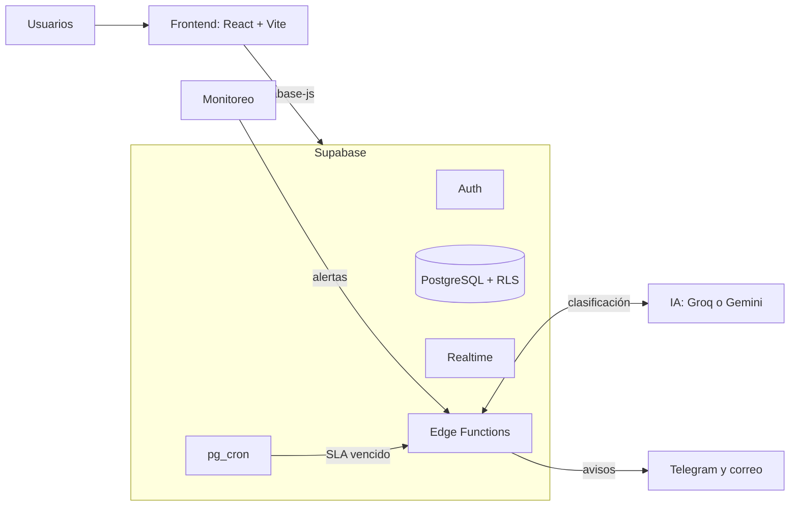

<div align="center">

# ITicket

**Plataforma web con inteligencia artificial para la gestión de incidentes de TI y la continuidad de negocio**

[](https://github.com/yeisondev001/ITicket/actions/workflows/ci.yml)


Proyecto Final · Instituto Tecnológico de Las Américas (ITLA)<br>
Tema pre-aprobado No. 28: *Sistema de Gestión de Incidentes y Continuidad de Negocio*

</div>

---

## Tabla de contenido

- [Descripción](#descripción)
- [Funcionalidades](#funcionalidades)
- [Arquitectura](#arquitectura)
- [Stack tecnológico](#stack-tecnológico)
- [Puesta en marcha](#puesta-en-marcha)
- [Estructura del repositorio](#estructura-del-repositorio)
- [Flujo de trabajo](#flujo-de-trabajo)
- [CI/CD](#cicd)
- [Documentación](#documentación)
- [Planificación](#planificación)
- [Equipo](#equipo)

## Descripción

En muchas organizaciones, los incidentes tecnológicos se reportan por correo, mensajes o
registros manuales. Eso dificulta saber qué es urgente, quién lo atiende y cuánto tarda en
resolverse, y deja a los servicios críticos sin un plan claro de recuperación.

**ITicket** centraliza todo el ciclo de un incidente en una sola plataforma:

1. **Detección**: los incidentes llegan desde un formulario o desde alertas de monitoreo.
2. **Clasificación**: un modelo de IA estima el impacto y la urgencia; la prioridad se calcula
   con la matriz de ITIL 4.
3. **Escalamiento**: el sistema vigila el SLA de cada ticket y escala automáticamente los que
   no se atienden a tiempo.
4. **Recuperación**: cada servicio crítico tiene su plan de recuperación (playbook), y los
   incidentes graves cierran con un post-mortem.

## Funcionalidades

| Módulo | Qué hace |
|---|---|
| **Tickets** | Registro, asignación, estados, comentarios y cierre con solución |
| **Clasificación con IA** | Categoría, impacto, urgencia y explicación, con respuesta validada por un esquema; si la confianza es baja, pasa a revisión manual |
| **SLA y escalamiento** | Tiempo máximo de atención por prioridad y escalamiento automático al supervisor |
| **Continuidad de negocio** | Catálogo de servicios críticos con RTO y RPO, playbooks de recuperación y post-mortems |
| **Notificaciones** | Avisos por Telegram y correo al técnico y al supervisor |
| **Dashboard** | Tiempos de respuesta y resolución, cumplimiento de SLA y precisión de la IA |
| **Auditoría** | Registro automático de cada cambio en una bitácora |

**Roles:** usuario, técnico, supervisor y administrador.

### Prioridad (matriz ITIL 4)

| Impacto \ Urgencia | Alta | Media | Baja |
|---|---|---|---|
| **Alto** | P1 | P2 | P3 |
| **Medio** | P2 | P3 | P4 |
| **Bajo** | P3 | P4 | P4 |

Un servicio marcado como crítico nunca queda por debajo de P2.

## Arquitectura



## Stack tecnológico

| Capa | Tecnologías |
|---|---|
| Frontend | React, Vite, TypeScript, Tailwind CSS, shadcn/ui |
| Backend | Supabase: PostgreSQL, Auth, Row Level Security, Realtime, Edge Functions, pg_cron |
| Inteligencia artificial | Groq o Google Gemini, con validación de respuesta mediante Zod |
| Notificaciones | Telegram Bot API, Resend |
| Calidad | Vitest, Playwright, oxlint |
| CI/CD | GitHub Actions, Supabase CLI |

## Puesta en marcha

**Requisitos:** Node.js 22 o superior y Git.

```bash
git clone https://github.com/yeisondev001/ITicket.git
cd ITicket
npm install
```

Copia `.env.example` como `.env.local` y completa los valores del proyecto de Supabase
(botón **Connect** del proyecto, o *Project Settings → API Keys*):

```bash
cp .env.example .env.local
```

Luego inicia el servidor de desarrollo:

```bash
npm run dev
```

### Scripts

| Comando | Descripción |
|---|---|
| `npm run dev` | Servidor de desarrollo |
| `npm run build` | Compilación de TypeScript y build de producción |
| `npm run lint` | Revisión de código con oxlint |
| `npm test` | Pruebas unitarias |
| `npm run test:watch` | Pruebas unitarias en modo observador |
| `npm run preview` | Vista previa del build |

## Estructura del repositorio

```
ITicket/
├── .github/workflows/   # Pipelines de CI y CD
├── docs/                # Documentación técnica
├── public/              # Archivos estáticos
├── src/
│   └── lib/             # Lógica de negocio (p. ej. cálculo de prioridad)
├── supabase/
│   ├── migrations/      # Cambios de la base de datos, en orden
│   └── config.toml      # Configuración del proyecto de Supabase
└── .env.example         # Plantilla de variables de entorno
```

## Flujo de trabajo

El equipo trabaja con **Scrum** en sprints de dos semanas. Las tareas viven en el
[tablero del proyecto](https://github.com/users/yeisondev001/projects/4).

| Rama | Uso |
|---|---|
| `main` | Versión estable; recibe `develop` al cierre de cada sprint |
| `develop` | Integración del trabajo diario |
| `tipo/número-descripción` | Una rama por tarea, por ejemplo `feature/12-login` |

**Tipos de rama:** `feature`, `fix`, `docs`, `test`, `refactor`, `chore` y `hotfix`.

**Ciclo de una tarea:**

1. Asignarse el issue y moverlo a *En progreso*.
2. Crear la rama desde `develop` actualizado.
3. Abrir un Pull Request hacia `develop` con `Closes #número`.
4. Con el CI en verde, hacer merge y borrar la rama.

## CI/CD

| Pipeline | Cuándo corre | Qué hace |
|---|---|---|
| **CI** | Cada Pull Request y cada push a `develop` o `main` | Lint, build y pruebas unitarias. `main` no acepta cambios con el CI en rojo |
| **CD Supabase** | Después de un CI exitoso en `develop` o `main` | Aplica migraciones y despliega Edge Functions: `develop` → pruebas, `main` → producción |

Detalle en [docs/CI-CD.md](docs/CI-CD.md).

## Documentación

| Documento | Contenido |
|---|---|
| [docs/CI-CD.md](docs/CI-CD.md) | Pipeline, ambientes y cómo configurarlos |
| [docs/modelo-de-datos.md](docs/modelo-de-datos.md) | Diagrama entidad-relación de la base de datos |

## Planificación

| Sprint | Fechas | Objetivo |
|---|---|---|
| 1 | 28 sep – 9 oct | Base del proyecto: CI/CD, Supabase, modelo de datos, mockups |
| 2 | 12 – 23 oct | Acceso y estructura: login, roles, gestión de usuarios |
| 3 | 26 oct – 6 nov | Tickets y clasificación con IA |
| 4 | 9 – 20 nov | Atención, SLA, escalamiento y continuidad |
| 5 | 23 nov – 4 dic | Notificaciones, dashboard y post-mortem |
| 6 | 7 – 18 dic | Pruebas de flujo, pruebas con usuarios y cierre |

## Equipo

Proyecto desarrollado por un equipo de 10 estudiantes del ITLA, organizado con el marco Scrum.

---

<div align="center">
<sub>Proyecto académico · Instituto Tecnológico de Las Américas (ITLA) · 2026</sub>
</div>
