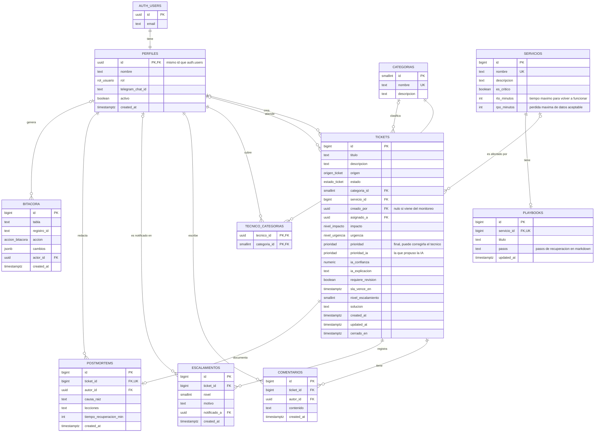

# Modelo de datos

Diagrama entidad-relación (nivel lógico-físico, notación pata de gallo) de la base de datos de
ITicket en Supabase (PostgreSQL). Es la referencia para las migraciones, las políticas RLS y los
formularios del frontend: si una tabla cambia, este diagrama se actualiza en el mismo PR.

## Tipos enumerados

| Tipo | Valores |
|---|---|
| `rol_usuario` | `usuario`, `tecnico`, `supervisor`, `administrador` |
| `origen_ticket` | `usuario`, `monitoreo` |
| `estado_ticket` | `nuevo`, `asignado`, `en_progreso`, `escalado`, `resuelto`, `cerrado` |
| `nivel_impacto` | `alto`, `medio`, `bajo` |
| `nivel_urgencia` | `alta`, `media`, `baja` |
| `prioridad` | `P1`, `P2`, `P3`, `P4` |
| `accion_bitacora` | `insert`, `update`, `delete` |

## Decisiones

- **`perfiles` extiende el login de Supabase.** Supabase Auth guarda correo y contraseña en `auth.users`; los datos propios del sistema (nombre, rol) van en `perfiles`, con el mismo `id`.
- **Prioridad de la IA separada de la final.** `prioridad_ia` guarda lo que propuso el modelo y `prioridad` la decisión final, que el técnico puede corregir. Comparar ambas mide la precisión de la IA para el Capítulo IV.
- **La prioridad sale de la matriz ITIL.** La IA estima `impacto` y `urgencia`; la prioridad se calcula con `src/lib/prioridad.ts`. Un servicio con `es_critico` nunca queda por debajo de P2.
- **Los tickets del monitoreo no tienen creador.** Por eso `creado_por` puede ser nulo.
- **No se borran usuarios.** Se desactivan con `activo`, para conservar el historial de sus tickets.

## Qué tabla se crea en cada tarea

| Tarea | Tablas |
|---|---|
| #6 Crear tablas base | `perfiles`, `categorias`, `tecnico_categorias`, `tickets`, `comentarios` |
| #22 Escalamiento por SLA | `escalamientos` |
| #23 Servicios críticos y playbooks | `servicios`, `playbooks` |
| #24 Bitácora de auditoría | `bitacora` |
| #29 Post-mortem | `postmortems` |

La columna `tickets.servicio_id` se agrega en la migración de #23, cuando ya existe `servicios`.
